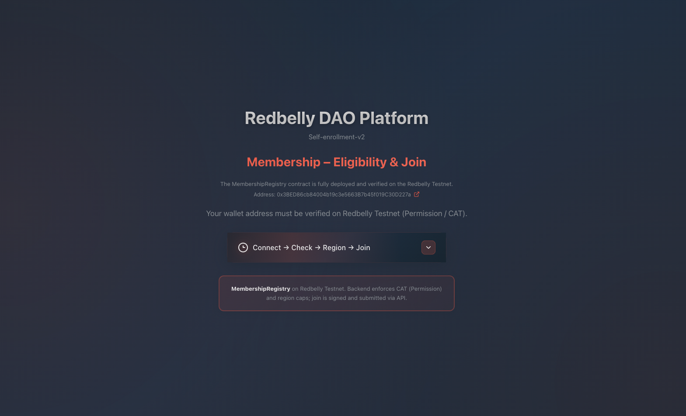

# Redbelly DAO Platform – Self-enrollment-v2

  
  
  
  
  
    
  
  
  
  

  

 

**Live demo (Redbelly Testnet):** [https://dao-v3.mynode.uk](https://dao-v3.mynode.uk)  
*(May be unavailable in the future; the repository contains the full source code.)*

 

Self-enrollment DAO membership platform for **Redbelly Testnet**. Users connect a wallet, prove eligibility via Redbelly Permission (CAT), choose a region, sign a declaration, and join the on-chain **MembershipRegistry**. The backend enforces policy (CAT + region caps) and submits the join transaction.

---

## Overview

- **On-chain:** `MembershipRegistry` contract – single source of truth for who is a member (`isMember(address)`), region hash, join/leave/migrate/revoke.
- **Backend:** Node/Express API – eligibility checks (CAT + contract), region caps, signed join/migrate/leave, admin revoke. Does **not** store PII; only address, region, and audit logs.
- **Frontend:** React (Vite) – connect wallet, check eligibility, select region, sign message, submit join. Displays DAO access status and contract link.

Eligibility to **join** requires:

1. Wallet is **verified on Redbelly (Permission / CAT)**.
2. Wallet is **not** already a member in the contract.
3. Selected **region** is under its cap (policy in backend).

---

## User flow

1. **Connect wallet** – User connects via browser extension (e.g. MetaMask); frontend detects address.
2. **Check eligibility** – Frontend calls `GET /api/eligibility?address=…`. Backend queries:
   - Permission (CAT) contract: `isAllowed(address)`.
   - MembershipRegistry: `isMember(address)`.
   - Returns `{ hasCAT, isMember, canJoin }`.
3. **Regions** – Frontend calls `GET /api/regions` for region list and current/cap counts (from contract + backend caps).
4. **Join (if eligible)** – User selects region, signs message `"I declare region <REGION> and accept DAO Terms v1"`. Frontend sends `POST /api/join` with `{ address, region, signature, message }`. Backend:
   - Verifies signature and message.
   - Re-checks CAT and `isMember`, region cap.
   - Calls `MembershipRegistry.join(user, region, message)` with backend signer.
   - Returns tx hash; frontend shows success and link to explorer.
5. **Leave** – Member signs `"I request to leave the DAO"`; backend calls contract (user can also call `leave()` in the block explorer). **Revoke** – DAO/admin only, via backend `POST /api/admin/revoke` or contract `revoke(user)` from DAO wallet.

Contract reads use `blockTag: "latest"` so eligibility reflects current chain state.

---

## Security

- **Backend key:** Backend holds the key that can call `join` and `migrate` on the contract. It must be kept secret and used only on a trusted server.
- **DAO key:** Only the `dao` address can call `revoke` and `updateBackend`/`updateDAO`. Typically the deployer/DAO wallet; revoke must be called from that wallet (e.g. in block explorer).
- **No PII on-chain:** Contract stores only address, region hash, and active flag. Backend audit log stores address, region, action, timestamp, tx hash – no other PII.
- **Signature verification:** Join/migrate/leave require a signed message; backend verifies signer and exact message format before calling the contract.
- **Policy layer:** CAT (Permission) and region caps are enforced in the backend before any on-chain write; the contract does not enforce caps (backend refuses when cap is reached).
- **CORS:** Backend uses `CORS_ORIGIN`; set to your frontend origin in production.

---

## Extensibility

- **Snapshot / governance:** The contract exposes `isMember(address)` (view). A Snapshot strategy can read this contract (e.g. contract-call with `isMember`) for 1-member-1-vote. Redbelly Testnet may require a self-hosted Snapshot instance with a custom network.
- **Region caps:** Edit `backend/src/db.js` – `DEFAULT_REGIONS` – to add/remove regions or change caps; restart backend.
- **New roles:** The contract has `backend` and `dao`. For separate governance (e.g. board, treasury), deploy additional contracts that read `MembershipRegistry` and/or extend with new roles and update scripts.
- **Verification / compliance:** Backend can be extended with extra checks before join (e.g. KYC, allowlists) while keeping the same contract interface.
- **Frontend:** Widget is self-contained (`RedbellyAuthWidget`); can be embedded in other apps by pointing API base URL to your backend.

---

## Repository structure

- `contracts/` – MembershipRegistry Solidity (and flattened for verification).
- `backend/` – Node API (eligibility, regions, join, migrate, leave, admin revoke).
- `frontend/` – React app and Redbelly auth widget; `frontend/public/Redbelly_Isotype-White.svg` (white isotype for README badges).
- `scripts/` – Deploy and verification scripts.
See **deploy.md** for deployment and environment setup.
